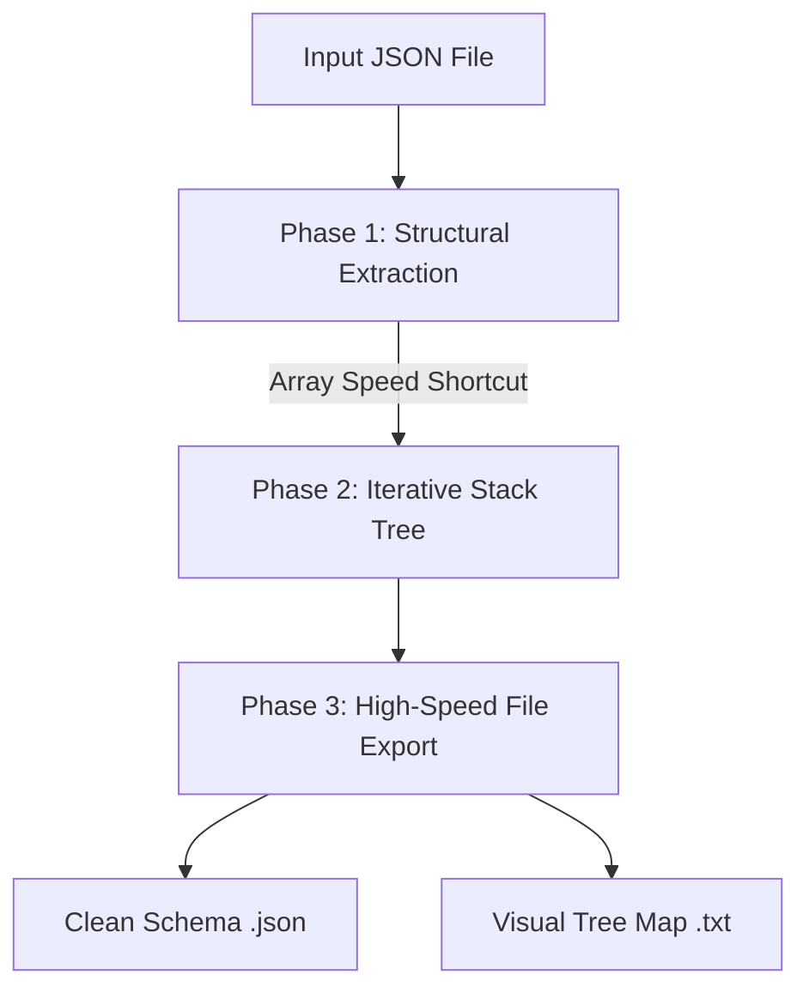

# 📋 JSON Structure Extractor

A lightweight, high-performance Python tool designed to automatically extract the hierarchical skeleton of any JSON file. It ignores data payloads and values, leaving you with a clean, structural map that is perfect for system documentation, API modeling, and schema sharing.

---

## ✨ Key Features
* **Zero Terminal Hassle**: Launches a native system file-picker popup window to browse and select files.
* **Dual Output Formats**: Generates both a programmatic `.json` type template and a human-readable `.txt` visual tree.
* **Massive File Optimization**: Uses a high-speed list shortcut to instantly bypass millions of repetitive row arrays.
* **Production-Grade Stability**: Built using a stack-based iterative engine to process deeply nested objects without crashing.

---

## 🛠️ Project Structure
To keep your workspace organized, set up your folder directory like this:
```text
your-project-folder/
├── structure.py             # The Python script
├── README.md                # This documentation file
├── JSON files/              # Place your raw input JSON files here
└── structure results/       # Output files will automatically generate here
```

---

## 🚀 How To Use It

### 1. Prerequisites
Ensure you have Python 3 installed on your machine. This script uses standard built-in libraries (`tkinter`, `json`, `os`, `sys`), so **no extra packages need to be installed** via pip.

### 2. Running the Tool
1. Drop the JSON file you want to investigate inside the `JSON files` folder.
2. Open your Terminal or Command Prompt in the project folder.
3. Execute the script:
   ```bash
   python structure.py
   ```
4. A file window will pop up. Select your target JSON file and hit **Open**.

---

## ⚙️ Working Principle (How It Works So Fast)

The core processing engine is broken down into three streamlined phases:



### Phase 1: Structural Extraction (`extract_schema`)
Instead of parsing every single line of data, the script strips away all values and replaces them with data type names (e.g., `str`, `int`). If the engine encounters an array containing thousands of identical objects, **it only inspects the first item**. It creates a template of that item and skips the remaining entries, turning a potential 5-minute operation into a millisecond calculation.

### Phase 2: Iterative Stack Mapping (`generate_text_tree_iterative`)
Standard recursive functions crash when dealing with production-grade datasets due to memory limits. This tool uses a flat `while` loop combined with a **LIFO Stack (Last In, First Out)** data structure. It processes your complex JSON structure like a flat checklist, making it immune to "maximum recursion depth" errors.

### Phase 3: Optimized Disk Outputs
The script minimizes disk activity by bundling data into memory buffers before exporting:
1. **The JSON Schema**: Saves a valid JSON object structure mapping out the keys.
2. **The TXT Tree**: Generates a clean, folder-style blueprint utilizing tree branches (`├──`) perfect for instant previews in Slack, Microsoft Teams, or text editors.
